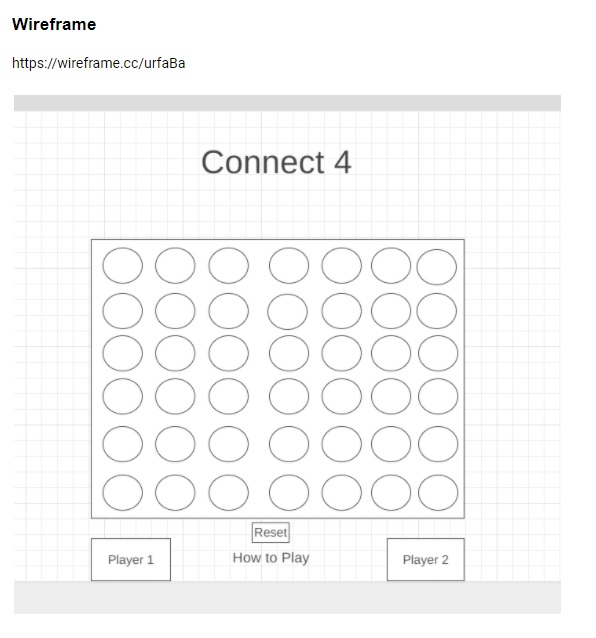
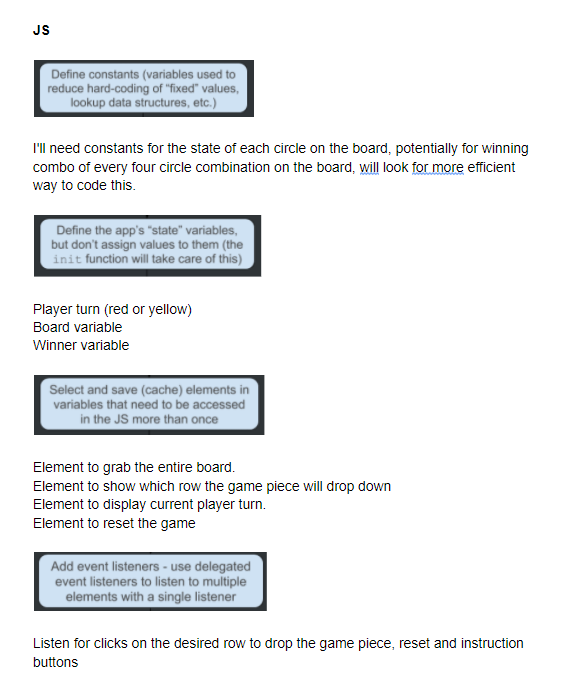
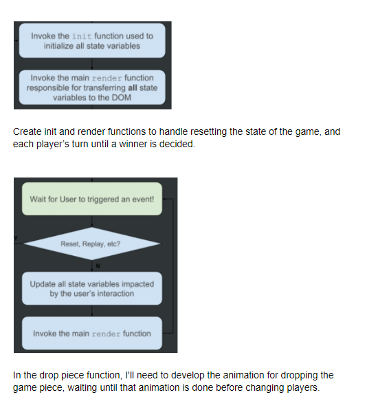

# Connect 4 
##
## Objective:
### - Create a browser-based game using HTML, CSS and JS
##
##
##
## To play the game:
### Click [here](http://connect-4-online.surge.sh) to play the game.
##
##
## Motivation:
### My partnet and I are really competitive when we play board games with each other, neither of us like to lose, which is good for me because I can usually win most the time. However, Connect Four is my achillies heel, my partner absolutley owns mental space in my head with how much I lose at Connect Four. After I implement the minimax AI and hone my skills, I will have my revenge tour! 
## Prototype View:
### Here is my initial drawing of the playing field:

### Here is an initial wire-frame of how the playing field will be set up:

### Here is what the playing field looks like, post styling:

## Technology Implemented:
- JavaScript
- CSS
- HTML
- Git 

## Credits:
- Background img https://www.wallpapertip.com/wpic/TxwRho_wood-table-blur-background/

## Pseudocode:

## Minimum Viable Product:
- As a user, I should be able to face off head to head with someone, alternating turns
- As a user, I should be able to place my game piece where I want it to go
- As a user, I should be able to know when I win or lose the game
- As a user, I should be able to reset the board to start a new game
- As a user, I should be able to see the instructions pop up when "how to play" is clicked
- As a user, I should be able to hear game piece falling sound after every turn and all the game pieces falling on reset

## Stretch Goals:
- Add visual of piece being dropped from top to cell location
- Enhance visuals for game pieces
- Add a random column "Easy" AI 
- Implement a minimax algo "Hard" AI 
- Re-construct backend to allow for cross browser multiplayer
- Add ability for player to select own color 
- Add mobile responsiveness